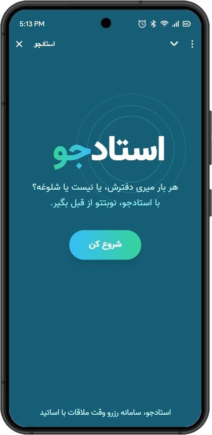
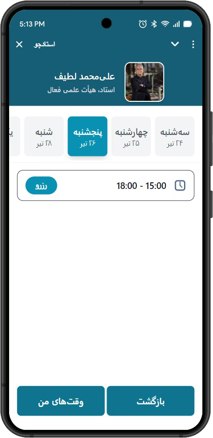
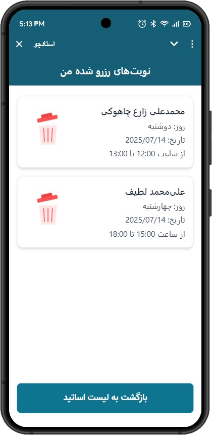

# 🎓 استادجو

یک مینی‌اپ تلگرامی برای رزرو ساده، سریع و هوشمند زمان ملاقات با اساتید — بدون نیاز به هماهنگی‌های حضوری یا پیام‌های وقت‌گیر!
<div style="heigh: 300px;"><br/></div>


## 💡 درباره استادجو

در محیط‌های دانشگاهی، یکی از چالش‌های رایج برای دانشجویان، هماهنگی با اساتید برای جلسات حضوری یا مشاوره است.  
برخی وقت‌ها دفتر استاد بسته‌ است، گاهی هم هماهنگی زمان‌ها دشوار می‌شود.

**استادجو** طراحی شده تا این مسیر را ساده و حرفه‌ای کند:

- استاد زمان‌های ملاقات خود را ثبت می‌کند  
- دانشجو زمان‌های آزاد استاد را می‌بیند  
- به‌راحتی زمان موردنظر را رزرو می‌کند  
- تأییدیه رزرو و یادآوری به صورت خودکار ارسال می‌شود


## 🚀 قابلیت‌ها

- 📅 نمایش زمان‌های آزاد استاد
- 🔐 ورود امن با حساب تلگرام
- ✅ رزرو لحظه‌ای و بی‌واسطه
- 🛎️ اطلاع‌رسانی رزرو به استاد و دانشجو
- 👤 پنل اختصاصی برای هر نقش (استاد / دانشجو)
- 🕒 امکان ثبت و ویرایش زمان‌های آزاد توسط استاد
- 👀 مشاهده وقت‌های رزرو شده توسط دانشجویان برای استاد
- 📱 طراحی شده برای استفاده سریع و موبایلی 

<div style="heigh: 300px;"><br/></div>

## 🖼️ تصاویر محیط برنامه

<div align="center" style="
  display: flex; 
  flex-wrap: wrap; 
  justify-content: center; 
  gap: 20px;
  max-width: 100%;
">

  
  
  

</div>

> تصاویر مربوط به نسخه‌ی آزمایشی هستند و ممکن است در آینده تغییر کنند.


## 🙋‍♂️ توسعه‌دهنده

Iman Karimian  
[🐙 GitHub](https://github.com/IK7D3) | [💼 LinkedIn](https://www.linkedin.com/in/iman-karimian-0757361b1/) | [✈️ Telegram](https://t.me/ik7d3) | [📧 ایمیل](mailto:imankarimian20@gmail.com) 


## 📁 ساختار پروژه

```plaintext
ostadjo/
├── front-end/     # رابط کاربری تلگرام
├── back-end/      # منطق سرور و رزروها
└── README.md      # مستندات اصلی پروژه
```

## ⚖️ لایسنس

MIT
